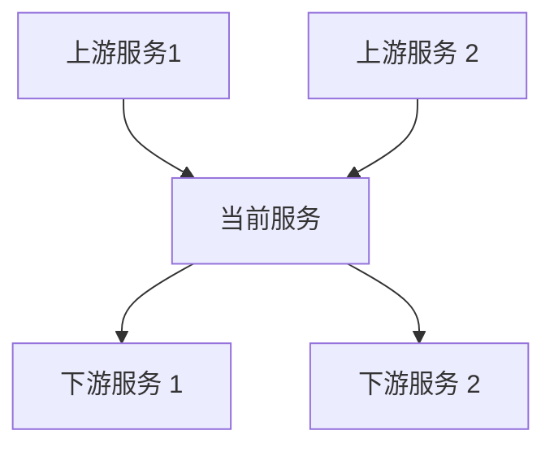
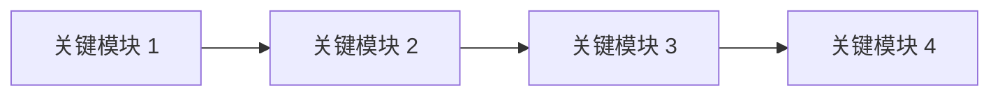

# 方案设计

**功能分支**：
**创建日期**：
**规范**：
**研究**：

## 1 概览
[对设计方案进行高维概述，说明该设计如何满足各项需求并融入整体系统架构。该部分应在保持简洁的同时兼顾全面性。]

## 2 技术背景

<!--
  需要操作: 将此部分内容替换为项目的技术细节.
  此处的结构以咨询性质呈现, 用于指导迭代过程.
-->

**语言/版本**: [例如: Python 3.11、Swift 5.9、Rust 1.75 或 需要澄清]
**主要依赖**: [例如: FastAPI、UIKit、LLVM 或 需要澄清]
**存储**: [如适用, 例如: PostgreSQL、CoreData、文件 或 不适用]
**测试**: [例如: pytest、XCTest、cargo test 或 需要澄清]
**目标平台**: [例如: Linux 服务器、iOS 15+、WASM 或 需要澄清]
**项目类型**: [单一/网页/移动 - 决定源代码结构]
**性能目标**: [领域特定, 例如: 1000 请求/秒、10k 行/秒、60 fps 或 需要澄清]
**约束条件**: [领域特定, 例如: <200ms p95、<100MB 内存、离线可用 或 需要澄清]
**规模/范围**: [领域特定, 例如: 10k 用户、1M 行代码、50 个屏幕 或 需要澄清]

## 3 项目结构
### 文档(此功能)

```
specs/[###-feature]/
├── research.md          # 阶段 0 输出 (/speckit.plan 命令)
├── technical-solution.md # 阶段 1 输出 (/speckit.plan 命令)
└── tasks.md             # 阶段 2 输出 (/speckit.tasks 命令 - 非 /speckit.plan 创建)
```

### 源代码(仓库根目录)
<!--
  需要操作: 将下面的占位符树结构替换为此功能的具体布局.
  删除未使用的选项, 并使用真实路径(例如: apps/admin、packages/something)扩展所选结构.
  交付的计划不得包含选项标签.
-->

```
# [如未使用请删除] 选项 1: 单一项目(默认)
src/
├── models/
├── services/
├── cli/
└── lib/

tests/
├── contract/
├── integration/
└── unit/

# [如未使用请删除] 选项 2: Web 应用程序(检测到"前端" + "后端"时)
backend/
├── src/
│   ├── models/
│   ├── services/
│   └── api/
└── tests/

frontend/
├── src/
│   ├── components/
│   ├── pages/
│   └── services/
└── tests/

# [如未使用请删除] 选项 3: 移动端 + API(检测到 "iOS/Android" 时)
api/
└── [同上后端结构]

ios/ 或 android/
└── [平台特定结构: 功能模块、UI 流程、平台测试]
```

## 4 项目架构
### 4.1 系统上下文
[描述当前需求如何融入整体系统，包括当前服务的上下游依赖]

### 4.2 系统架构
[请说明系统的整体架构设计思路及其主要组成部分]


## 5 核心实体
[请说明该需求涉及的所有核心实体，包括服务内部实体，以及外部依赖的实体]
### 5.1 服务内部实体
#### 实体1: [Entity Name]
**位置**：[实体所处服务位置]

**职责**：[该实体在当前需求的职责]

**字段定义**：

| 字段名 | 类型 | 必填 | 是否新增字段 | 说明   |
|--------|------|----|--------|------|
| id | long | ✅  | ✅      | 商品ID |

**关键说明**：
[一些未在定义中声明的、补充性的关键信息，比如字段数据来源、字段计算逻辑、字段使用场景等]

### 5.2 外部依赖接口实体
#### 实体1：[Entity Name]
**来源**：[该实体属于哪个外部依赖服务]

**用途**：[该实体在当前需求的功能]

**字段定义**：

| 字段名 | 类型 | 必填 | 说明   |
|--------|------|----|------|
| id | long | ✅  | 商品ID |


**关键说明**：
[一些未在定义中声明的、补充性的关键信息，比如字段计算逻辑、字段使用场景等]

## 6 关键功能
[请说明该需求涉及的所有关键功能，包括核心流程、异常处理、边界条件等]
### 6.1 关键组件与接口
#### 组件1：[组件名]
**位置**：[组件所处服务位置]

**职责**：[该组件在当前需求的职责]

**接口**：
- input:[该组件在当前需求接收的数据]
- output:[该组件经过逻辑处理后，产出的数据]

**依赖项**：
- [*继承依赖]
- [*数据依赖]
- [*直接下游接口依赖 / 外部接口依赖]
  - [maven信息]
  - [接口service#method定义、出参、入参]
  - [依赖内容]

**核心逻辑（核心功能）**：
1. 核心逻辑一：[需要使用自然语言描述分支条件、核心处理逻辑、涉及的关键实体或关键字段]
2. 核心逻辑二：[需要使用自然语言描述分支条件、核心处理逻辑、涉及的关键实体或关键字段]

**单元测试**：[需要针对‘关键组件’中的核心逻辑编写单元测试用例]
- 用例1：[用例描述、预期表现]

**边界场景**：[针对“核心逻辑”编写边界场景测试用例]
- 边界场景1：[边界场景描述]
    - 解决方式：[解决方式描述]

**异常处理**：[可能存在哪些异常，应该如何处理（超时、异常返回、代码BUG等）]

### 6.2 组件依赖关系
[请描述，方案中设计的组件之间的依赖关系]

### 6.3 数据流图
[请根据关键组件设计与组件依赖关系，使用时序图的方式，描述核心数据流转情况]

## 7 API设计
[本次需求涉及的当前服务定义的所有RPC接口 或者 HTTP接口，无需关心外部接口依赖]
### 7.1 API 1：[接口类名#方法名]
**位置**:[接口在服务中的具体位置]

**用途**:[接口的主要功能]

**是否新增接口**:[是 or 否]

**接口入参**:[入参实体]

**接口出参**:[出参实体]

**关键说明**：[关键性的补充说明信息]

## 8 宪章合规性检查
[请逐条说明该需求如何满足项目章程，至少覆盖以下项目]
- 代码质量: 模块职责清晰、复杂度可控、命名与结构可维护
- 测试标准: 测试策略覆盖核心路径、关键边界与回归场景
- 用户体验一致性: 交互模式、文案与反馈机制与既有能力保持一致
- 性能要求: 明确性能预算（时延/吞吐/资源）与验证方案
- 范围控制: 说明为何未引入非需求驱动的复杂机制，满足 YAGNI 与“禁止过度设计”

## 9 方案设计checkList
### 架构
- [ ] 高维架构描述清晰
- [ ] 组件职责定义清晰
- [ ] 组件之间的依赖关系已明确
- [ ] 技术选型有合理的论证

### 需求符合度
- [ ] 设计满足所有功能性需求
- [ ] 已考虑非功能性需求
- [ ] 该设计可以满足成功标准
- [ ] 已处理或说明约束和假设

### 技术质量
- [ ] 设计遵循既定的模式和原则
- [ ] 已考虑安全性相关问题
- [ ] 已考虑性能要求
- [ ] 错误处理机制全面
- [ ] 明确说明未引入非必要复杂机制（符合禁止过度设计）

### 实施准备度
- [ ] 设计细节足以支撑实现
- [ ] 数据实体完整且已验证
- [ ] API 规格说明详尽
- [ ] 测试策略全面

### 可维护性
- [ ] 设计支持未来的可扩展性
- [ ] 组件之间保持松耦合
- [ ] 配置实现外部化
- [ ] 包含监控和可观测性设计
- [ ] 用户可见行为与现有体验保持一致

