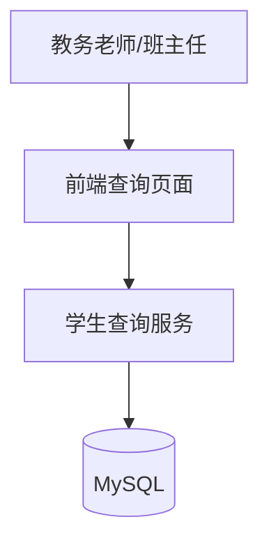
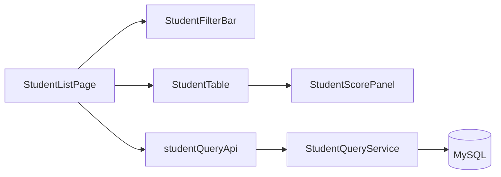
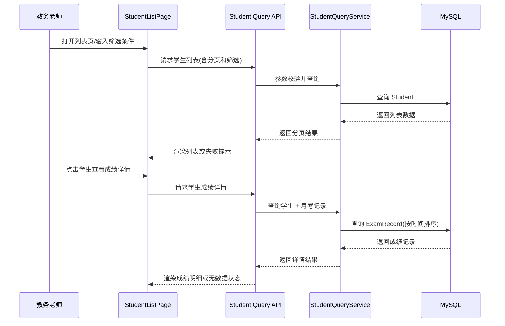

# 方案设计

**功能分支**：`feature/SPEC-202603271613/001-student-score-management`
**创建日期**：2026-03-27
**规范**：`/Users/1998hx/Desktop/python-study/specs/001-student-score-management/spec.md`
**研究**：`/Users/1998hx/Desktop/python-study/specs/001-student-score-management/temp/research.md`

## 1 概览
本方案为“学生信息与月考成绩查询”提供可落地实现路径，覆盖学生列表展示、学生成绩详情查询与多条件搜索。  
设计遵循“先可用、可验证、最小必要实现”原则，仅实现需求中明确提出的查看与搜索能力，不扩展新增/编辑/删除、统计报表或权限体系。  
核心目标是保证在 10,000 条学生数据规模下，查询流程稳定、可重试、结果可理解，且用户可在统一交互模式下高效定位目标学生。
同时明确接口边界：创建学生接口与查询学生列表接口必须拆分为两个独立接口职责，避免读写语义混用。

## 2 技术背景
**语言/版本**: Python 3.11（后端）, TypeScript 5.x（前端）
**主要依赖**: FastAPI + SQLAlchemy（后端）, React + Vite（前端）
**存储**: MySQL 8
**测试**: pytest（后端）, Vitest + React Testing Library（前端）
**目标平台**: Linux 服务器 + 现代浏览器
**项目类型**: Web 应用（前后端分离）
**性能目标**: 在 10,000 条学生数据规模下，95% 搜索请求在 2s 内返回可见结果
**约束条件**: 学号全局唯一；列表支持分页；查询失败必须提供可重试反馈
**规模/范围**: 单校内部教务与班主任场景，学生规模 1 万内，月考记录规模 50 万内

## 3 项目结构
### 文档(此功能)

```
specs/001-student-score-management/
├── spec.md
├── design.md
├── tasks.md
└── checklists/
    └── requirements.md
```

### 源代码(仓库根目录)

```
backend/
├── src/
│   ├── api/
│   │   └── student_query.py
│   ├── models/
│   │   ├── student.py
│   │   └── exam_record.py
│   ├── schemas/
│   │   └── student_query.py
│   └── services/
│       └── student_query_service.py
└── tests/
    ├── contract/
    ├── integration/
    └── unit/

frontend/
├── src/
│   ├── components/
│   │   ├── StudentFilterBar.tsx
│   │   ├── StudentTable.tsx
│   │   └── StudentScorePanel.tsx
│   ├── pages/
│   │   └── StudentListPage.tsx
│   ├── services/
│   │   └── studentQueryApi.ts
│   └── types/
│       └── student.ts
└── tests/
    ├── unit/
    └── integration/
```

## 4 项目架构
### 4.1 系统上下文
教务老师或班主任在前端列表页查看学生并执行搜索，前端通过查询 API 获取列表和详情数据，后端进行条件校验、分页处理和排序后从 MySQL 返回结果。


### 4.2 系统架构
采用“页面层-组件层-服务层-存储层”分层架构。前端负责筛选交互和状态反馈，后端负责查询拼装、分页排序、异常映射。  
同一份查询条件模型在前后端对齐，避免术语漂移与字段歧义。


## 5 核心实体
### 5.1 服务内部实体
#### 实体1: Student
**位置**：`backend/src/models/student.py`

**职责**：存储学生基础档案，支撑列表展示与筛选。

**字段定义**：

| 字段名 | 类型 | 必填 | 是否新增字段 | 说明 |
|--------|------|------|------------|------|
| id | bigint | ✅ | ✅ | 主键 |
| student_no | varchar(32) | ✅ | ✅ | 学号，唯一 |
| name | varchar(64) | ✅ | ✅ | 姓名 |
| gender | enum('male','female') | ✅ | ✅ | 性别 |
| grade | varchar(16) | ✅ | ✅ | 年级 |
| class_name | varchar(16) | ✅ | ✅ | 班级 |
| created_at | datetime | ✅ | ✅ | 创建时间 |
| updated_at | datetime | ✅ | ✅ | 更新时间 |

**关键说明**：
- `student_no` 用于准确识别学生，需数据库唯一索引保障。
- 列表页默认展示 `name/student_no/gender`，`grade/class_name` 主要用于筛选。

#### 实体2: ExamRecord
**位置**：`backend/src/models/exam_record.py`

**职责**：存储学生每次月考成绩与考试时间，支撑详情页时间序列展示。

**字段定义**：

| 字段名 | 类型 | 必填 | 是否新增字段 | 说明 |
|--------|------|------|------------|------|
| id | bigint | ✅ | ✅ | 主键 |
| student_id | bigint | ✅ | ✅ | 学生ID |
| exam_time | datetime | ✅ | ✅ | 考试时间 |
| subject | varchar(32) | ✅ | ✅ | 科目 |
| score | decimal(5,2) | ✅ | ✅ | 分数 |
| created_at | datetime | ✅ | ✅ | 创建时间 |
| updated_at | datetime | ✅ | ✅ | 更新时间 |

**关键说明**：
- 同一学生成绩明细按 `exam_time` 排序返回，便于纵向对比。
- 对异常或缺失时间采用兜底文案，避免前端展示中断。

### 5.2 外部依赖接口实体
本需求无第三方外部服务依赖，仅依赖前端应用、后端服务与 MySQL。

## 6 关键功能
### 6.1 关键组件与接口
#### 组件1：StudentListPage
**位置**：`frontend/src/pages/StudentListPage.tsx`

**职责**：承载列表展示、筛选状态、分页状态、错误与重试交互。

**接口**：
- input: 查询条件（grade/className/name）、分页参数（page/pageSize）
- output: 学生列表、总数、加载状态、失败状态

**依赖项**：
- `frontend/src/components/StudentFilterBar.tsx`
- `frontend/src/components/StudentTable.tsx`
- `frontend/src/services/studentQueryApi.ts`

**核心逻辑（核心功能）**：
1. 页面初始化加载学生列表，渲染姓名、学号、性别三列。
2. 用户变更筛选条件后重新请求并保持分页/筛选状态一致。
3. 请求失败时展示可重试提示，用户点击重试后恢复加载流程。

**单元测试**：
- 用例1：初始化成功渲染列表三项基础信息。
- 用例2：筛选条件变化触发新请求并刷新列表。
- 用例3：加载失败展示错误提示且重试后恢复。

**边界场景**：
- 边界场景1：学生字段缺失
  - 解决方式：表格使用占位符（如 `--`）显示，不阻断渲染。
- 边界场景2：无匹配结果
  - 解决方式：显示“无匹配学生”且保留当前筛选条件。

**异常处理**：
- 网络超时：显示统一失败提示与重试入口。
- 400 参数错误：提示筛选参数非法并回退到最近有效条件。
- 500 服务异常：显示友好错误文案，允许重试。

#### 组件2：StudentQueryService
**位置**：`backend/src/services/student_query_service.py`

**职责**：统一处理学生列表查询、组合筛选、详情成绩查询与错误映射。

**接口**：
- input: 查询 DTO（筛选条件、分页参数、学生ID）
- output: 列表结果 DTO、详情结果 DTO、标准化错误

**依赖项**：
- `Student`、`ExamRecord` 模型
- 查询仓储/ORM 会话

**核心逻辑（核心功能）**：
1. 列表查询：按年级/班级/姓名条件动态拼装查询并返回分页结果。
2. 详情查询：按学生 ID 获取学生基础信息和月考记录，记录按考试时间排序。
3. 空结果与异常路径：无成绩/无匹配返回空集合与提示标识；异常映射为可识别错误码。

**单元测试**：
- 用例1：组合筛选仅返回交集结果。
- 用例2：学生无月考记录时返回空记录且状态正常。
- 用例3：异常情况下输出标准化错误结构。

**边界场景**：
- 边界场景1：重名学生
  - 解决方式：始终以 `student_no` 区分并返回。
- 边界场景2：异常考试时间数据
  - 解决方式：跳过无效排序键或使用默认排序兜底并记录告警。

**异常处理**：
- 参数校验失败 -> 400
- 学生不存在 -> 404
- 未知异常 -> 500

### 6.2 组件依赖关系
- `StudentListPage` 依赖 `StudentFilterBar` 与 `StudentTable` 呈现交互与数据。
- `StudentTable` 触发详情查看，依赖 `StudentScorePanel` 展示成绩明细。
- 前端 API 层 `studentQueryApi` 依赖后端查询接口。
- 后端控制器依赖 `StudentQueryService` 执行查询与错误映射。

### 6.3 数据流图


## 7 API设计
### 7.1 API 1：GET /api/v1/students
**位置**: `backend/src/api/student_query.py`

**用途**: 查询学生列表，支持分页和年级/班级/姓名条件筛选

**是否新增接口**: 是

**接口入参**: `ListStudentsRequest(grade?, className?, name?, page, pageSize)`

**接口出参**: `ListStudentsResponse(items[], total, page, pageSize)`

**关键说明**: 请求失败需返回可重试错误信息；无结果返回空列表与总数 0。

### 7.2 API 2：GET /api/v1/students/{studentId}/scores
**位置**: `backend/src/api/student_query.py`

**用途**: 查询指定学生月考记录及考试时间

**是否新增接口**: 是

**接口入参**: `studentId`

**接口出参**: `StudentScoresResponse(student, examRecords[])`

**关键说明**: 学生不存在返回 404；无成绩返回空数组和“暂无月考数据”标识字段。

### 7.3 接口边界约束
**约束说明**: “创建学生”与“查询学生列表”必须拆分为独立接口能力。  
**当前范围**: 本功能仅实现只读查询接口（`GET /api/v1/students` 与 `GET /api/v1/students/{studentId}/scores`），不承载创建逻辑。  
**跨规范协同**: 创建能力在 `specs/002-add-student-score-entry` 中定义并维护。
**验证记录（2026-04-01）**: 已通过 `backend/tests/contract/test_list_students_api.py` 增加“无创建副作用”与“写语义参数拒绝”断言，确保列表接口保持只读。

## 8 宪章合规性检查
本方案合规性评估结果：通过。
- 代码质量: 明确页面、组件、服务、模型职责边界，降低耦合并支持审查。
- 测试标准: 前后端均定义了核心路径、边界与异常测试，覆盖回归风险点。
- 用户体验一致性: 统一空态、错误态、重试态文案与交互，避免体验割裂。
- 性能要求: 明确 10k 数据规模下 p95 <= 2s 目标，并在任务中增加验证步骤。
- 范围控制: 仅实现列表、详情、搜索，不引入增删改、报表、消息通知等扩展能力。

## 9 方案设计checkList
### 架构
- [x] 高维架构描述清晰
- [x] 组件职责定义清晰
- [x] 组件之间的依赖关系已明确
- [x] 技术选型有合理的论证

### 需求符合度
- [x] 设计满足所有功能性需求
- [x] 已考虑非功能性需求
- [x] 该设计可以满足成功标准
- [x] 已处理或说明约束和假设

### 技术质量
- [x] 设计遵循既定的模式和原则
- [x] 已考虑安全性相关问题
- [x] 已考虑性能要求
- [x] 错误处理机制全面
- [x] 明确说明未引入非必要复杂机制（符合禁止过度设计）

### 实施准备度
- [x] 设计细节足以支撑实现
- [x] 数据实体完整且已验证
- [x] API 规格说明详尽
- [x] 测试策略全面

### 可维护性
- [x] 设计支持未来的可扩展性
- [x] 组件之间保持松耦合
- [x] 配置实现外部化
- [x] 包含监控和可观测性设计
- [x] 用户可见行为与现有体验保持一致
