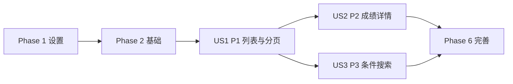

# 任务: 学生信息与月考成绩查询

**输入**: 来自 `/specs/001-student-score-management/` 的设计文档
**前置条件**: `design.md`、`spec.md`

**测试**: 规范明确要求关键路径与边界可测试，包含测试任务并遵循 TDD（先测后实现）。

**组织结构**: 任务按用户故事分组，确保每个故事可独立开发、测试与演示。

## 格式: `[ID] [P?] [Story] 描述`
- **[P]**: 可并行执行（不同文件、无直接依赖）
- **[Story]**: 任务所属用户故事（US1、US2、US3）

## 路径约定
- 后端: `backend/src/`、`backend/tests/`
- 前端: `frontend/src/`、`frontend/tests/`

---

## 阶段 1: 设置（共享基础设施）

**目的**: 建立查询功能的前后端基础骨架与共享类型。

- [ ] T001 [P] [Setup] 在 `backend/src/api/student_query.py` 创建查询路由文件骨架并注册 `/api/v1/students` 路由前缀
- [ ] T002 [P] [Setup] 在 `frontend/src/services/studentQueryApi.ts` 创建查询 API 客户端骨架（listStudents/getStudentScores）
- [ ] T003 [P] [Setup] 在 `frontend/src/types/student.ts` 定义列表项、筛选条件、详情记录等类型

---

## 阶段 2: 基础（阻塞前置条件）

**目的**: 完成所有用户故事共享且阻塞的模型、Schema、服务基础能力。

**⚠️ 关键**: 本阶段完成前，不进入任一用户故事实现。

- [ ] T004 [Foundational] 在 `backend/src/models/student.py` 定义 `Student` 模型与 `student_no` 唯一约束
- [ ] T005 [Foundational] 在 `backend/src/models/exam_record.py` 定义 `ExamRecord` 模型及 `student_id/exam_time` 相关索引
- [ ] T006 [P] [Foundational] 在 `backend/src/schemas/student_query.py` 定义列表查询请求与响应 Schema
- [ ] T007 [P] [Foundational] 在 `backend/src/schemas/student_query.py` 定义成绩详情响应 Schema（含空态标识）
- [ ] T008 [Foundational] 在 `backend/src/services/student_query_service.py` 建立查询服务骨架与统一错误类型映射（400/404/500）
- [ ] T009 [Foundational] 在 `backend/src/api/student_query.py` 接入统一异常到 HTTP 状态码映射与可重试错误结构

**检查点**: 基础模型、Schema 与错误映射可用，支持各故事并行推进。

---

## 阶段 3: 用户故事 1 - 查看学生列表与基础信息（优先级: P1）🎯 MVP

**目标**: 在列表页展示姓名、学号、性别，支持分页，并在异常时可重试。

**独立测试**: 打开列表页可见基础信息；翻页正常；字段缺失有占位；加载失败可重试。

### 用户故事 1 的测试（先写并确保失败）⚠️

- [ ] T010 [P] [US1] 在 `backend/tests/contract/test_list_students_api.py` 编写 `GET /api/v1/students` 合约测试（成功、分页、参数非法）
- [ ] T011 [P] [US1] 在 `backend/tests/integration/test_students_list_query.py` 编写列表分页与缺失字段占位集成测试
- [ ] T012 [P] [US1] 在 `frontend/tests/integration/student_list_page.test.tsx` 编写列表渲染与分页切换测试
- [ ] T013 [P] [US1] 在 `frontend/tests/unit/student_list_error_retry.test.tsx` 编写加载失败与重试交互测试

### 用户故事 1 的实现

- [ ] T014 [US1] 在 `backend/src/services/student_query_service.py` 实现列表查询（分页、基础字段映射、空字段兜底）
- [ ] T015 [US1] 在 `backend/src/api/student_query.py` 实现 `GET /api/v1/students` 控制器
- [ ] T016 [US1] 在 `frontend/src/components/StudentTable.tsx` 实现基础列渲染与占位符策略
- [ ] T017 [US1] 在 `frontend/src/pages/StudentListPage.tsx` 接入列表数据加载、分页状态与重试逻辑

**检查点**: US1 可独立交付并作为 MVP 演示。

---

## 阶段 4: 用户故事 2 - 查看学生月考成绩明细（优先级: P2）

**目标**: 支持查看指定学生全部月考记录（成绩+考试时间），并按考试时间排序。

**独立测试**: 从列表进入详情后可看到完整记录；无成绩有明确空态；多次记录按时间排序展示。

### 用户故事 2 的测试（先写并确保失败）⚠️

- [ ] T018 [P] [US2] 在 `backend/tests/contract/test_student_scores_api.py` 编写 `GET /api/v1/students/{studentId}/scores` 合约测试（成功、404、空记录）
- [ ] T019 [P] [US2] 在 `backend/tests/integration/test_student_scores_query.py` 编写成绩时间排序与空态集成测试
- [ ] T020 [P] [US2] 在 `frontend/tests/integration/student_score_panel.test.tsx` 编写成绩详情展示与空态测试

### 用户故事 2 的实现

- [ ] T021 [US2] 在 `backend/src/services/student_query_service.py` 实现详情查询与按考试时间排序逻辑
- [ ] T022 [US2] 在 `backend/src/api/student_query.py` 实现 `GET /api/v1/students/{studentId}/scores` 控制器
- [ ] T023 [US2] 在 `frontend/src/components/StudentScorePanel.tsx` 实现成绩明细面板（时间+分数）与“暂无月考数据”状态
- [ ] T024 [US2] 在 `frontend/src/pages/StudentListPage.tsx` 接入从列表触发详情查看流程

**检查点**: US2 可独立运行，完成“查看成绩明细”闭环。

---

## 阶段 5: 用户故事 3 - 多条件搜索学生（优先级: P3）

**目标**: 支持按年级、班级、姓名及组合条件查询，且无结果时提供明确提示。

**独立测试**: 单条件和组合条件返回准确结果；无匹配时提示“无匹配学生”并保留条件。

### 用户故事 3 的测试（先写并确保失败）⚠️

- [ ] T025 [P] [US3] 在 `backend/tests/contract/test_students_filter_api.py` 编写筛选合约测试（年级、班级、姓名、组合条件）
- [ ] T026 [P] [US3] 在 `backend/tests/integration/test_students_filtering.py` 编写交集筛选与无结果集成测试
- [ ] T027 [P] [US3] 在 `frontend/tests/integration/student_filter_flow.test.tsx` 编写筛选栏交互与结果联动测试

### 用户故事 3 的实现

- [ ] T028 [US3] 在 `backend/src/services/student_query_service.py` 实现组合筛选查询拼装与参数校验
- [ ] T029 [US3] 在 `backend/src/api/student_query.py` 扩展列表接口筛选参数解析（grade/className/name）
- [ ] T030 [US3] 在 `frontend/src/components/StudentFilterBar.tsx` 实现筛选栏与条件输入组件
- [ ] T031 [US3] 在 `frontend/src/pages/StudentListPage.tsx` 实现筛选条件状态保持与无结果提示

**检查点**: US3 独立可验证，搜索能力完整可用。

---

## 阶段 6: 完善与横切关注点

**目的**: 完成跨故事回归、性能验证与文档同步。

- [ ] T032 [P] [Polish] 在 `backend/tests/integration/test_student_query_end_to_end.py` 增加端到端回归（列表->详情->筛选）
- [ ] T033 [P] [Polish] 在 `frontend/tests/integration/student_query_end_to_end.test.tsx` 增加端到端回归（筛选保持、空态、错误重试）
- [ ] T034 [Polish] 执行并记录性能验证（10k 数据规模下 p95 搜索 <=2s）到 `specs/001-student-score-management/design.md`
- [ ] T035 [Polish] 在 `specs/001-student-score-management/spec.md` 更新验收验证记录与范围守卫确认

---

## 依赖关系与执行顺序

### 阶段依赖关系

- 阶段 1（设置）可立即开始。
- 阶段 2（基础）依赖阶段 1，阻塞所有用户故事。
- 阶段 3/4/5（US1/US2/US3）都依赖阶段 2。
- 阶段 6（完善）依赖至少目标发布范围内用户故事完成。

### 用户故事依赖关系

- **US1（P1）**: 基础完成后可直接启动，无其他故事依赖（MVP）。
- **US2（P2）**: 依赖 US1 列表入口已可用，复用列表中的学生选择流程。
- **US3（P3）**: 依赖 US1 列表查询能力，可与 US2 并行推进。

### 用户故事完成顺序图



### 每个用户故事内部

- 测试任务必须先于实现任务。
- 数据模型/Schema 在服务逻辑前完成。
- 服务逻辑在 API 与页面集成前完成。
- 同一文件的任务按顺序执行，不标记 `[P]`。

### 并行机会

- 设置阶段：T001-T003 可并行。
- 基础阶段：T006 与 T007 可并行。
- US1：T010-T013 可并行。
- US2：T018-T020 可并行。
- US3：T025-T027 可并行。
- 阶段 6：T032 与 T033 可并行。

---

## 并行示例: 用户故事 1

```bash
# 并行编写 US1 测试
任务: T010 backend/tests/contract/test_list_students_api.py
任务: T011 backend/tests/integration/test_students_list_query.py
任务: T012 frontend/tests/integration/student_list_page.test.tsx
任务: T013 frontend/tests/unit/student_list_error_retry.test.tsx
```

---

## 实施策略

### 仅 MVP（仅用户故事 1）

1. 完成阶段 1 与阶段 2
2. 完成阶段 3（US1）
3. 独立验证列表展示、分页、失败重试后再演示

### 增量交付

1. 交付 US1：先解决“可查看列表”的核心入口
2. 交付 US2：补齐成绩详情价值
3. 交付 US3：提升定位效率与可用性
4. 最后执行阶段 6 回归与性能验证
