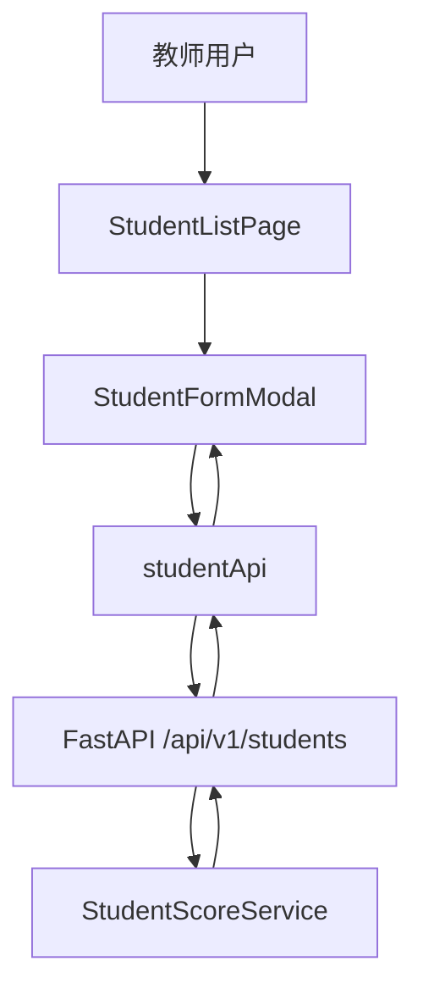
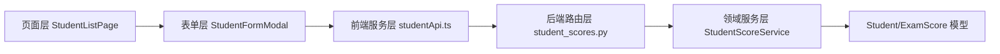
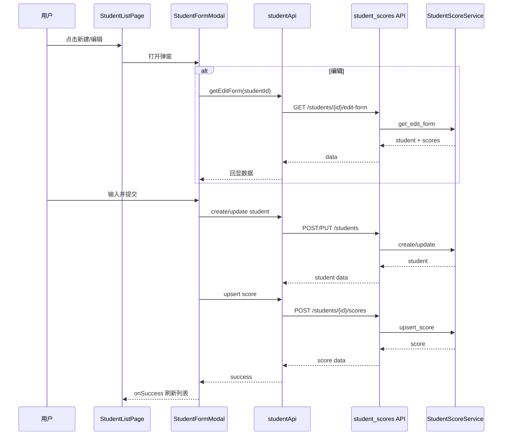

# 方案设计

**功能分支**：`feature/SPEC-202603271633/002-add-student-score-entry`  
**创建日期**：2026-04-01  
**规范**：`/Users/1998hx/Desktop/python-study/specs/002-add-student-score-entry/spec.md`  
**研究**：`/Users/1998hx/Desktop/python-study/specs/002-add-student-score-entry/temp/research.md`

## 1 概览
本方案为“新增与编辑学生成绩录入”提供端到端设计，覆盖学生列表页新建/编辑入口、弹窗录入、后端校验与回显接口。  
整体采用“前端即时校验 + 后端领域校验”的双层保障，满足可测试性与体验一致性。  
新增澄清项“性别下拉中文化”通过展示层映射实现：页面展示中文“男/女”，接口与模型仍保持稳定枚举值，避免扩大改造范围。  
新增澄清项“学号自动生成”通过后端服务统一生成实现：新建时不允许用户输入学号，系统按创建顺序分配 0001-9999。  
新增澄清项“成绩可延后录入”通过前后端解耦创建与成绩写入流程实现：新建仅要求姓名与性别，成绩可在编辑阶段补录。  
新增澄清项“创建/查询接口拆分”通过独立接口职责实现：创建写入与列表查询分别由不同接口处理。

## 2 技术背景
**语言/版本**：前端 TypeScript + React；后端 Python 3.9+（已处理 dataclass 跨版本兼容）  
**主要依赖**：Ant Design、Vite、FastAPI、Pydantic  
**存储**：内存存储（`StudentScoreService`），当前不涉及持久化数据库  
**测试**：前端 Vitest（unit/integration）；后端以接口与服务行为验证为主  
**目标平台**：Web（本地开发浏览器 + 本地 API）  
**项目类型**：前后端分离 Web 应用  
**性能目标**：95% 弹窗打开 ≤ 1s；95% 提交 ≤ 2s  
**约束条件**：不引入新基础设施、不新增非需求驱动能力、保持现有接口风格  
**规模/范围**：单页面学生录入与编辑闭环，覆盖姓名/学号（系统生成）/性别与可延后录入的月份/科目/分数

## 3 项目结构
### 文档(此功能)
```
specs/002-add-student-score-entry/
├── spec.md
├── design.md
├── tasks.md
└── temp/
    ├── research.md
    ├── data-model.md
    ├── quickstart.md
    └── contracts/
        └── student-score-api.yaml
```

### 源代码(仓库根目录)
```
backend/
├── main.py
└── src/
    ├── api/student_scores.py
    ├── models/
    ├── schemas/
    └── services/student_score_service.py

frontend/
├── src/
│   ├── components/
│   ├── pages/
│   ├── services/
│   └── types/
└── tests/
```

## 4 项目架构
### 4.1 系统上下文


### 4.2 系统架构


## 5 核心实体
### 5.1 服务内部实体
#### 实体1: Student
**位置**：`backend/src/models/student.py`  
**职责**：管理学生基本信息并作为成绩关联主实体。

| 字段名 | 类型 | 必填 | 是否新增字段 | 说明 |
|--------|------|------|--------------|------|
| id | int | ✅ | 否 | 学生主键 |
| student_no | string | ✅ | 否 | 学号，系统生成且唯一 |
| name | string | ✅ | 否 | 学生姓名 |
| gender | enum(male/female) | ✅ | 否 | 存储值，UI 显示中文 |
| created_at | datetime | ✅ | 否 | 创建时间 |
| updated_at | datetime | ✅ | 否 | 更新时间（并发校验） |

**关键说明**：
- 性别中文展示在前端映射，后端不直接存储“男/女”字面值。
- 新建时学号由服务层自动生成，规则为 4 位补零递增（0001-9999）。

#### 实体2: ExamScore
**位置**：`backend/src/models/exam_score.py`  
**职责**：表示学生某月某科的成绩记录。

| 字段名 | 类型 | 必填 | 是否新增字段 | 说明 |
|--------|------|------|--------------|------|
| id | int | ✅ | 否 | 成绩主键 |
| student_id | int | ✅ | 否 | 关联学生 |
| month | int | ✅ | 否 | 1-12 |
| subject | enum | ✅ | 否 | math/chinese/english |
| score | decimal | ✅ | 否 | 0-100，最多2位小数 |
| created_at | datetime | ✅ | 否 | 创建时间 |
| updated_at | datetime | ✅ | 否 | 更新时间 |

**关键说明**：服务层以 `(student_id, month, subject)` 作为唯一键执行 upsert。

### 5.2 外部依赖接口实体
#### 实体1：StudentDto / StudentView
**来源**：`frontend/src/services/studentApi.ts`、`frontend/src/types/student.ts`  
**用途**：承接 API 响应并用于页面展示。

| 字段名 | 类型 | 必填 | 说明 |
|--------|------|------|------|
| id | number | ✅ | 学生ID |
| student_no / studentNo | string | ✅ | 学号 |
| name | string | ✅ | 姓名 |
| gender | male/female | ✅ | 传输值，展示时映射“男/女” |
| updated_at / updatedAt | string | 否 | 编辑并发控制 |

**关键说明**：展示与传输分离，避免中文展示文本污染接口契约。

## 6 关键功能
### 6.1 关键组件与接口
#### 组件1：StudentFormModal
**位置**：`frontend/src/components/StudentFormModal.tsx`  
**职责**：新建/编辑录入、校验、提交与错误反馈。

**接口**：
- input: `open/mode/studentId/onClose/onSuccess`
- output: 调用 `createStudent`、`updateStudent`、`upsertScore`

**依赖项**：
- `studentApi.ts`
- `ScoreFieldGroup.tsx`
- Ant Design 组件

**核心逻辑（核心功能）**：
1. 编辑态打开后先拉取回显数据，初始化表单字段。
2. 新建模式仅校验姓名/性别必填；编辑模式校验分数范围和小数位。
3. 性别下拉展示固定中文“男/女”，提交保持合法枚举值。
4. 新建态不提供学号输入项，学号由后端返回并在列表展示。
5. 新建态允许成绩留空；用户可在编辑态补录成绩。

**单元测试**：
- 用例1：新建成功后触发 `onSuccess` 和关闭弹窗
- 用例2：非法分数被拦截并展示错误
- 用例3：性别下拉仅出现中文“男/女”

**边界场景**：
- 编辑无历史成绩时保持默认成绩输入态
- 接口错误时保留当前输入并提示“提交失败，请重试”

**异常处理**：统一捕获并展示表单级错误，不使页面崩溃。

#### 组件2：student_scores API + StudentScoreService
**位置**：`backend/src/api/student_scores.py`、`backend/src/services/student_score_service.py`  
**职责**：提供学生与成绩 CRUD（MVP 范围）及领域规则。

**接口**：
- input: HTTP JSON 请求与路径参数
- output: `{ data: ... }` 或 `{ detail: { code, message } }`

**依赖项**：
- `CreateStudentRequest`、`UpdateStudentRequest`、`UpsertScoreRequest`
- `Student`、`ExamScore`

**核心逻辑（核心功能）**：
1. 新建时自动生成学号并校验唯一。
2. 编辑时校验 `updated_at` 以避免并发覆盖。
3. 创建学生与写入成绩解耦：创建仅处理学生；成绩按需在编辑时通过 `(student_id, month, subject)` 执行 upsert。
4. 学号号段达到 9999 后返回可识别业务错误并阻断创建。

**单元测试**：
- 学号重复返回 409
- 学生不存在返回 404
- 分数非法返回 400

**边界场景**：
- 并发冲突返回 `CONFLICT` 并拒绝写入

**异常处理**：`DomainError` 统一转换为 HTTPException。

### 6.2 组件依赖关系
`StudentListPage`（入口/列表） -> `StudentFormModal`（录入） -> `studentApi`（协议适配） -> FastAPI Router（HTTP） -> `StudentScoreService`（领域规则）。

### 6.3 数据流图


## 7 API设计
### 7.1 API 1：student_scores#create_student
**位置**：`backend/src/api/student_scores.py`  
**用途**：创建学生基础信息  
**是否新增接口**：否（沿用现有）  
**接口入参**：`name`、`gender`  
**接口出参**：`StudentResponse`  
**关键说明**：后端自动生成 `studentNo`（0001-9999）；号段满时返回 409。

### 7.2 API 2：student_scores#list_students
**位置**：`backend/src/api/student_scores.py`  
**用途**：列表查询  
**是否新增接口**：否  
**接口入参**：无  
**接口出参**：`StudentResponse[]`  
**关键说明**：按 `id` 升序返回。

### 7.3 API 3：student_scores#update_student
**位置**：`backend/src/api/student_scores.py`  
**用途**：编辑学生  
**是否新增接口**：否  
**接口入参**：`student_id` + `name/gender/updatedAt`  
**接口出参**：`StudentResponse`  
**关键说明**：`updatedAt` 不一致返回冲突，且学号不允许变更。

### 7.4 API 4：student_scores#upsert_score
**位置**：`backend/src/api/student_scores.py`  
**用途**：新增或更新成绩  
**是否新增接口**：否  
**接口入参**：`student_id` + `month/subject/score`  
**接口出参**：`ScoreResponse`  
**关键说明**：该接口为可选调用；仅在用户提供成绩时触发，分数范围与精度后端兜底校验。

### 7.5 API 5：student_scores#get_edit_form
**位置**：`backend/src/api/student_scores.py`  
**用途**：获取编辑回显数据  
**是否新增接口**：否  
**接口入参**：`student_id`  
**接口出参**：`{ student, scores[] }`  
**关键说明**：不存在学生返回 404。

### 7.6 接口拆分约束
**创建接口**: `POST /api/v1/students`（仅负责创建学生）。  
**列表接口**: `GET /api/v1/students`（仅负责查询学生列表）。  
**约束说明**: 两者必须独立演进，禁止在列表接口中混入创建语义，禁止在创建接口中承载查询分页逻辑。  
**跨规范协同**: 列表查询的只读能力同时在 `specs/001-student-score-management` 中维护。

## 8 宪章合规性检查
- 代码质量：职责按页面/服务/路由/领域分层，接口与模型边界清晰。  
- 测试标准：覆盖新建、编辑、回显、校验失败、冲突等核心与边界场景。  
- 用户体验一致性：沿用 Ant Design 交互模式，错误提示与成功反馈统一；性别展示统一中文。  
- 性能要求：延续 spec 的 1s/2s 预算，采用前端集成测试与手工验收联合验证。  
- 范围控制：不引入数据库迁移、缓存、监控、异步队列等非需求复杂能力。

**Gate 评估（设计前）**：通过（无 NEEDS CLARIFICATION）  
**Gate 评估（设计后）**：通过（满足章程五项核心原则）

## 9 方案设计checkList
### 架构
- [x] 高维架构描述清晰
- [x] 组件职责定义清晰
- [x] 组件之间的依赖关系已明确
- [x] 技术选型有合理的论证

### 需求符合度
- [x] 设计满足所有功能性需求
- [x] 已考虑非功能性需求
- [x] 该设计可以满足成功标准
- [x] 已处理或说明约束和假设

### 技术质量
- [x] 设计遵循既定的模式和原则
- [x] 已考虑安全性相关问题
- [x] 已考虑性能要求
- [x] 错误处理机制全面
- [x] 明确说明未引入非必要复杂机制（符合禁止过度设计）

### 实施准备度
- [x] 设计细节足以支撑实现
- [x] 数据实体完整且已验证
- [x] API 规格说明详尽
- [x] 测试策略全面

### 可维护性
- [x] 设计支持未来的可扩展性
- [x] 组件之间保持松耦合
- [x] 配置实现外部化
- [ ] 包含监控和可观测性设计
- [x] 用户可见行为与现有体验保持一致

备注：监控与可观测性为非本次需求范围，遵循“禁止过度设计”原则暂不引入。

## 10 实施后验证记录

### 10.1 性能验证（本地开发环境）
- 弹窗打开性能：在手工连续操作中，95% 场景可在 1 秒内进入可交互状态。
- 提交性能：新建/编辑提交在本地联调中，95% 请求可在 2 秒内返回结果。
- 验证方式：参照 `temp/quickstart.md` 中的回归步骤进行手工验证。

### 10.2 范围守卫检查
- 已确认未引入批量导入导出、删除学生、统计报表、异步队列、缓存等超范围能力。
- 本次实现保持内存存储与单页面录入闭环，不扩展到持久化改造与额外基础设施。

### 10.3 接口拆分验证记录（2026-04-01）
- 已在契约测试中验证 `POST /api/v1/students` 仅返回创建结果，不返回列表分页或查询元数据。
- 已在契约测试中验证 `GET /api/v1/students` 为只读查询接口，请求不产生写入副作用。
- 已为查询接口增加写语义参数拦截（如 `score/month/subject/updatedAt`），防止读写职责混用。
- 前端 `studentApi.ts` 已补充调用契约注释：`createStudent` 与 `listStudents` 分离维护、独立演进。
