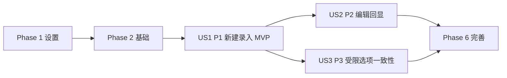

# 任务: 新增与编辑学生成绩录入

**输入**: 来自 `/specs/002-add-student-score-entry/` 的设计文档
**前置条件**: `design.md`、`spec.md`

**测试**: 本功能规范明确要求关键路径与边界场景可测试，包含测试任务并按 TDD 顺序（先写测试，再实现）。

**组织结构**: 任务按用户故事分组，确保每个故事可独立实现、独立验证、独立演示。

## 格式: `[ID] [P?] [Story] 描述`
- **[P]**: 可以并行执行（不同文件、无直接依赖）
- **[Story]**: 任务所属用户故事（US1、US2、US3）

## 路径约定
- 后端: `backend/src/`、`backend/tests/`
- 前端: `frontend/src/`、`frontend/tests/`

---

## 阶段 1: 设置（共享基础设施）

**目的**: 建立本功能实现所需的最小脚手架与类型约定。

- [ ] T001 [P] [Setup] 在 `backend/src/api/student_scores.py` 创建路由文件骨架并注册 `students` 相关路由前缀
- [ ] T002 [P] [Setup] 在 `frontend/src/services/studentApi.ts` 创建学生与成绩 API 客户端骨架（create/update/upsert/getEditForm）
- [ ] T003 [P] [Setup] 在 `frontend/src/types/student.ts` 定义前后端交互 DTO 与枚举类型（gender/month/subject）

---

## 阶段 2: 基础（阻塞前置条件）

**目的**: 完成所有用户故事共享且阻塞实现的核心能力。

**⚠️ 关键**: 完成本阶段前，不应开始任何用户故事开发。

- [ ] T004 [Foundational] 在 `backend/src/models/student.py` 定义 `Student` 模型及 `student_no` 唯一约束
- [ ] T005 [Foundational] 在 `backend/src/models/exam_score.py` 定义 `ExamScore` 模型及 `(student_id, month, subject)` 唯一约束
- [ ] T006 [P] [Foundational] 在 `backend/src/schemas/student.py` 定义创建/更新学生请求与响应 Schema（含学号唯一性相关字段）
- [ ] T007 [P] [Foundational] 在 `backend/src/schemas/score.py` 定义成绩请求与响应 Schema（含分数 0-100、最多 2 位小数规则）
- [ ] T008 [Foundational] 在 `backend/src/services/student_score_service.py` 建立事务边界、领域错误类型与错误码映射（400/404/409/500）
- [ ] T009 [Foundational] 在 `backend/src/api/student_scores.py` 统一接入参数校验失败、冲突、未找到、未知异常的 HTTP 映射

**检查点**: 数据模型、Schema、服务错误映射已就绪，可进入用户故事实现。

---

## 阶段 3: 用户故事 1 - 新建学生与成绩记录（优先级: P1）🎯 MVP

**目标**: 支持从“新建”弹窗录入学生基本信息和单月单科成绩并成功落库显示。

**独立测试**: 点击“新建”→填写姓名/学号/分数并选择性别/月/科目→提交后列表可见新增记录；非法输入被拦截并提示。

### 用户故事 1 的测试（先写并确保失败）⚠️

- [ ] T010 [P] [US1] 在 `backend/tests/contract/test_create_student_api.py` 编写 `POST /api/v1/students` 合约测试（成功、学号重复 409、必填缺失 400）
- [ ] T011 [P] [US1] 在 `backend/tests/contract/test_upsert_score_api.py` 编写 `POST /api/v1/students/{studentId}/scores` 合约测试（成功、分数越界/精度超限 400）
- [ ] T012 [P] [US1] 在 `frontend/tests/integration/student_create_flow.test.tsx` 编写新建弹窗集成测试（成功关闭弹窗并刷新列表）
- [ ] T013 [P] [US1] 在 `frontend/tests/unit/student_form_validation.test.tsx` 编写表单校验单测（必填、范围、2 位小数）

### 用户故事 1 的实现

- [ ] T014 [US1] 在 `backend/src/services/student_score_service.py` 实现“创建学生”业务流程（校验学号唯一→创建学生）
- [ ] T015 [US1] 在 `backend/src/services/student_score_service.py` 实现“写入成绩”流程（校验 month/subject/score→upsert 成绩）
- [ ] T016 [US1] 在 `backend/src/api/student_scores.py` 实现 `POST /api/v1/students` 与 `POST /api/v1/students/{studentId}/scores` 控制器
- [ ] T017 [US1] 在 `frontend/src/components/ScoreFieldGroup.tsx` 实现成绩输入与枚举选择区（月份/科目/分数）
- [ ] T018 [US1] 在 `frontend/src/components/StudentFormModal.tsx` 实现 create 模式提交流程与字段级错误展示
- [ ] T019 [US1] 在 `frontend/src/pages/StudentListPage.tsx` 接入“新建”按钮、打开弹窗、提交成功后刷新列表

**检查点**: US1 可独立运行并满足 MVP（录入入口 + 成功落库 + 基础校验）。

---

## 阶段 4: 用户故事 2 - 编辑并回显学生成绩信息（优先级: P2）

**目标**: 支持编辑弹窗回显现有学生与成绩，并仅更新变更数据。

**独立测试**: 列表点击“编辑”→弹窗回显完整信息→修改部分字段保存→列表显示更新且未修改字段保持原值。

### 用户故事 2 的测试（先写并确保失败）⚠️

- [ ] T020 [P] [US2] 在 `backend/tests/contract/test_update_student_api.py` 编写 `PUT /api/v1/students/{studentId}` 合约测试（成功、版本冲突 409、学号冲突 409）
- [ ] T021 [P] [US2] 在 `backend/tests/contract/test_edit_form_api.py` 编写 `GET /api/v1/students/{studentId}/edit-form` 合约测试（成功、学生不存在 404）
- [ ] T022 [P] [US2] 在 `frontend/tests/integration/student_edit_flow.test.tsx` 编写编辑流程集成测试（回显、部分修改、保存成功）
- [ ] T023 [P] [US2] 在 `frontend/tests/unit/student_no_change_submit.test.tsx` 编写“无变更保存”单测（提示并阻止请求）

### 用户故事 2 的实现

- [ ] T024 [US2] 在 `backend/src/services/student_score_service.py` 实现编辑流程（版本校验、字段差异更新、冲突映射）
- [ ] T025 [US2] 在 `backend/src/services/student_score_service.py` 实现编辑回显查询（学生信息 + 成绩集合聚合）
- [ ] T026 [US2] 在 `backend/src/api/student_scores.py` 实现 `PUT /api/v1/students/{studentId}` 与 `GET /api/v1/students/{studentId}/edit-form`
- [ ] T027 [US2] 在 `frontend/src/components/StudentFormModal.tsx` 实现 edit 模式初始化回显与部分更新提交
- [ ] T028 [US2] 在 `frontend/src/pages/StudentListPage.tsx` 接入操作列“编辑”按钮、加载回显、保存后局部刷新

**检查点**: US2 可独立运行并支持“回显 + 修改 + 保存”的闭环。

---

## 阶段 5: 用户故事 3 - 受限选项确保录入一致性（优先级: P3）

**目标**: 在新建/编辑统一使用受限枚举输入，防止非法选项写入。

**独立测试**: 打开新建/编辑弹窗，性别仅男/女，月份仅 1-12，科目仅数学/语文/英语；非法值无法提交。

### 用户故事 3 的测试（先写并确保失败）⚠️

- [ ] T029 [P] [US3] 在 `backend/tests/unit/test_enum_validation.py` 编写枚举边界单测（gender/month/subject 非法值）
- [ ] T030 [P] [US3] 在 `frontend/tests/unit/enum_options_guard.test.tsx` 编写前端受限选项单测（选项集合与非法值拦截）

### 用户故事 3 的实现

- [ ] T031 [US3] 在 `backend/src/schemas/student.py` 与 `backend/src/schemas/score.py` 收敛枚举约束与错误消息格式
- [ ] T032 [US3] 在 `frontend/src/types/student.ts` 统一前端枚举常量与显示文案映射
- [ ] T033 [US3] 在 `frontend/src/components/StudentFormModal.tsx` 与 `frontend/src/components/ScoreFieldGroup.tsx` 仅渲染受限选项并阻止非法提交

**检查点**: US3 独立可验证，录入一致性规则前后端一致。

---

## 阶段 6: 完善与横切关注点

**目的**: 完成功能收尾、回归验证与文档同步。

- [ ] T034 [P] [Polish] 在 `specs/002-add-student-score-entry/temp/quickstart.md` 更新手工验证步骤（新建/编辑/边界场景）
- [ ] T035 [Polish] 在 `backend/tests/integration/test_student_score_end_to_end.py` 增加后端端到端回归（新建→编辑→回显）
- [ ] T036 [Polish] 在 `frontend/tests/integration/student_score_end_to_end.test.tsx` 增加前端端到端集成回归（新建→编辑→列表刷新）
- [ ] T037 [Polish] 执行并记录性能验证（95% 弹窗打开 <=1s、95% 提交 <=2s）到 `specs/002-add-student-score-entry/design.md`
- [ ] T038 [Polish] 执行范围守卫检查，确认未引入批量导入、删除、报表等超范围能力，并更新 `specs/002-add-student-score-entry/spec.md`

---

## 依赖关系与执行顺序

### 阶段依赖关系

- 阶段 1（设置）可立即开始。
- 阶段 2（基础）依赖阶段 1 完成，并阻塞全部用户故事。
- 阶段 3（US1）、阶段 4（US2）、阶段 5（US3）都依赖阶段 2 完成。
- 阶段 6（完善）依赖至少目标发布范围内的用户故事完成。

### 用户故事依赖关系

- **US1（P1）**: 无故事级前置依赖，基础阶段后可直接实现（MVP）。
- **US2（P2）**: 依赖 US1 已有的数据录入能力与实体结构。
- **US3（P3）**: 可与 US2 并行收敛校验，但建议在 US1/US2 主流程稳定后完成。

### 用户故事完成顺序图



### 每个用户故事内部顺序

- 测试任务先于实现任务（TDD）。
- 模型/Schema → 服务 → API/前端组件 → 页面集成。
- 同一文件修改默认串行，不加 `[P]`。

### 并行机会

- 设置阶段：T001-T003 可并行。
- 基础阶段：T006 与 T007 可并行。
- US1：T010-T013 可并行；后端实现与前端组件实现可分工并行（遵守接口契约）。
- US2：T020-T023 可并行。
- US3：T029-T030 可并行。

---

## 并行执行示例

## 并行示例: 用户故事 1

```bash
# 并行编写 US1 测试
任务: T010 backend/tests/contract/test_create_student_api.py
任务: T011 backend/tests/contract/test_upsert_score_api.py
任务: T012 frontend/tests/integration/student_create_flow.test.tsx
任务: T013 frontend/tests/unit/student_form_validation.test.tsx

# 后端与前端并行实现（以接口契约为边界）
任务: T014-T016 backend/src/services/student_score_service.py + backend/src/api/student_scores.py
任务: T017-T019 frontend/src/components/*.tsx + frontend/src/pages/StudentListPage.tsx
```

## 并行示例: 用户故事 2

```bash
# 并行编写 US2 测试
任务: T020 backend/tests/contract/test_update_student_api.py
任务: T021 backend/tests/contract/test_edit_form_api.py
任务: T022 frontend/tests/integration/student_edit_flow.test.tsx
任务: T023 frontend/tests/unit/student_no_change_submit.test.tsx
```

## 并行示例: 用户故事 3

```bash
# 并行收敛前后端枚举校验
任务: T029 backend/tests/unit/test_enum_validation.py
任务: T030 frontend/tests/unit/enum_options_guard.test.tsx
任务: T031 backend/src/schemas/student.py + backend/src/schemas/score.py
任务: T032-T033 frontend/src/types/student.ts + frontend/src/components/*.tsx
```

---

## 实施策略

### MVP 优先（仅 US1）

1. 完成阶段 1-2（设置 + 基础）
2. 完成阶段 3（US1）
3. 执行 US1 独立测试并演示“可录入”闭环
4. 通过后再进入 US2/US3

### 增量交付

1. 交付 US1：解决“无录入入口”核心问题
2. 交付 US2：补齐“可修正”能力，提升数据准确性
3. 交付 US3：统一受限选项，提升数据一致性
4. 最后执行阶段 6 横切回归与性能验证
