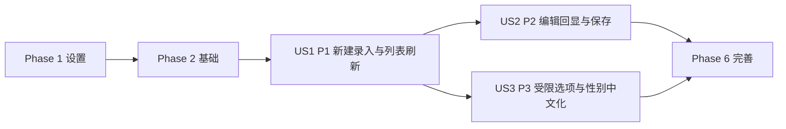

# 任务: 新增与编辑学生成绩录入

**输入**: 来自 `/specs/002-add-student-score-entry/` 的设计文档  
**前置条件**: `design.md`（必需）、`spec.md`（必需）

**测试**: 规范明确要求关键路径与边界场景可测试，按 TDD 顺序组织（先测后实现）。

**组织结构**: 任务按用户故事分组，保证每个故事可独立开发、验证与演示。

## 格式: `[ID] [P?] [Story] 描述`
- **[P]**: 可并行（不同文件且无直接依赖）
- **[Story]**: 任务归属（US1 / US2 / US3）

## 路径约定
- 后端: `backend/src/`、`backend/tests/`
- 前端: `frontend/src/`、`frontend/tests/`

---

## 阶段 1: 设置（共享基础设施）

**目的**: 搭建实现本功能的最小共享骨架。

- [X] T001 [P] [Setup] 在 `backend/main.py` 注册 FastAPI 应用、CORS 和学生路由
- [X] T002 [P] [Setup] 在 `backend/src/api/student_scores.py` 建立学生成绩路由骨架（含 `/api/v1/students` 前缀）
- [X] T003 [P] [Setup] 在 `frontend/src/services/studentApi.ts` 建立 API 客户端骨架（list/create/update/upsert/getEditForm）
- [X] T004 [P] [Setup] 在 `frontend/src/types/student.ts` 定义 DTO、枚举常量及展示映射类型

---

## 阶段 2: 基础（阻塞前置条件）

**目的**: 完成所有用户故事共享且阻塞的核心能力。

**⚠️ 关键**: 本阶段完成前，不进入任何用户故事实现。

- [X] T005 [Foundational] 在 `backend/src/models/student.py` 定义 `Student` 与 `student_no` 唯一约束语义
- [X] T006 [Foundational] 在 `backend/src/models/exam_score.py` 定义 `ExamScore` 与 `(student_id, month, subject)` 唯一键语义
- [X] T007 [P] [Foundational] 在 `backend/src/schemas/student.py` 定义创建/更新请求与响应模型（含学号字段校验）
- [X] T008 [P] [Foundational] 在 `backend/src/schemas/score.py` 定义成绩请求与响应模型（0-100、最多2位小数）
- [X] T009 [Foundational] 在 `backend/src/services/student_score_service.py` 建立领域错误类型与 400/404/409/500 映射
- [X] T010 [Foundational] 在 `backend/src/api/student_scores.py` 统一接入参数错误/冲突/未找到/未知错误的 HTTP 映射

**检查点**: 模型、Schema、服务错误映射就绪，可以开始用户故事开发。

---

## 阶段 3: 用户故事 1 - 新建学生与成绩记录（优先级: P1）🎯 MVP

**目标**: 在列表页通过“新建”弹窗完成学生与单月单科成绩录入，并可刷新看到新增结果。

**独立测试**: 点击“新建”→填写姓名/学号/分数并选择性别/月/科目→提交后列表出现新增项；非法输入被拦截提示。

### 用户故事 1 的测试（先写并确保失败）⚠️

- [X] T011 [P] [US1] 在 `backend/tests/contract/test_create_student_api.py` 编写 `POST /api/v1/students` 合约测试（成功、学号重复409、必填缺失400）
- [X] T012 [P] [US1] 在 `backend/tests/contract/test_upsert_score_api.py` 编写 `POST /api/v1/students/{studentId}/scores` 合约测试（成功、范围/精度400）
- [X] T013 [P] [US1] 在 `backend/tests/contract/test_list_students_api.py` 编写 `GET /api/v1/students` 合约测试（空列表、创建后可见）
- [X] T014 [P] [US1] 在 `frontend/tests/integration/student_create_flow.test.tsx` 编写新建流程测试（成功关闭弹窗并刷新）
- [X] T015 [P] [US1] 在 `frontend/tests/unit/student_form_validation.test.tsx` 编写表单校验测试（必填、范围、2位小数）

### 用户故事 1 的实现

- [X] T016 [US1] 在 `backend/src/services/student_score_service.py` 实现 `create_student`（学号唯一校验 + 创建）
- [X] T017 [US1] 在 `backend/src/services/student_score_service.py` 实现 `upsert_score`（month/subject/score 校验 + upsert）
- [X] T018 [US1] 在 `backend/src/services/student_score_service.py` 实现 `list_students`（按 id 升序返回）
- [X] T019 [US1] 在 `backend/src/api/student_scores.py` 实现 `POST /students`、`POST /students/{id}/scores`、`GET /students`
- [X] T020 [US1] 在 `frontend/src/components/ScoreFieldGroup.tsx` 实现月份/科目受限选择与分数输入
- [X] T021 [US1] 在 `frontend/src/components/StudentFormModal.tsx` 实现 create 提交链路与表单级错误反馈
- [X] T022 [US1] 在 `frontend/src/pages/StudentListPage.tsx` 接入新建入口、列表加载与提交后刷新

**检查点**: US1 可独立运行，满足 MVP（有录入入口、可保存、可查看、基础校验完整）。

---

## 阶段 4: 用户故事 2 - 编辑并回显学生成绩信息（优先级: P2）

**目标**: 支持从操作列进入编辑弹窗，回显已有信息并保存变更。

**独立测试**: 列表点击“编辑”→弹窗回显完整信息→修改部分字段后保存→列表显示更新且未修改字段保持不变。

### 用户故事 2 的测试（先写并确保失败）⚠️

- [X] T023 [P] [US2] 在 `backend/tests/contract/test_update_student_api.py` 编写 `PUT /api/v1/students/{studentId}` 合约测试（成功、版本冲突409、学号冲突409）
- [X] T024 [P] [US2] 在 `backend/tests/contract/test_edit_form_api.py` 编写 `GET /api/v1/students/{studentId}/edit-form` 合约测试（成功、不存在404）
- [X] T025 [P] [US2] 在 `frontend/tests/integration/student_edit_flow.test.tsx` 编写编辑流程集成测试（回显、修改、保存）
- [X] T026 [P] [US2] 在 `frontend/tests/unit/student_no_change_submit.test.tsx` 编写无变更提交测试（阻止请求并提示）

### 用户故事 2 的实现

- [X] T027 [US2] 在 `backend/src/services/student_score_service.py` 实现 `update_student`（版本校验、冲突映射、字段更新）
- [X] T028 [US2] 在 `backend/src/services/student_score_service.py` 实现 `get_edit_form`（学生+成绩集合聚合）
- [X] T029 [US2] 在 `backend/src/api/student_scores.py` 实现 `PUT /students/{id}` 与 `GET /students/{id}/edit-form`
- [X] T030 [US2] 在 `frontend/src/components/StudentFormModal.tsx` 实现 edit 初始化回显、部分更新提交流程
- [X] T031 [US2] 在 `frontend/src/pages/StudentListPage.tsx` 接入编辑按钮、保存后刷新与失败提示

**检查点**: US2 可独立验证，形成“回显 + 修改 + 保存”闭环。

---

## 阶段 5: 用户故事 3 - 受限选项确保录入一致性（优先级: P3）

**目标**: 新建/编辑统一受限选项，并满足“性别下拉只显示中文男/女”。

**独立测试**: 打开新建/编辑弹窗，性别仅“男/女”，月份仅 1-12，科目仅数学/语文/英语；非法值无法提交。

### 用户故事 3 的测试（先写并确保失败）⚠️

- [X] T032 [P] [US3] 在 `backend/tests/unit/test_enum_validation.py` 编写枚举边界单测（gender/month/subject 非法值）
- [X] T033 [P] [US3] 在 `frontend/tests/unit/enum_options_guard.test.tsx` 编写受限选项与中文性别文案测试

### 用户故事 3 的实现

- [X] T034 [US3] 在 `backend/src/schemas/student.py` 与 `backend/src/schemas/score.py` 收敛枚举校验与错误消息格式
- [X] T035 [US3] 在 `frontend/src/types/student.ts` 增加性别值与中文文案映射（仅展示“男/女”）
- [X] T036 [US3] 在 `frontend/src/components/StudentFormModal.tsx` 与 `frontend/src/components/ScoreFieldGroup.tsx` 强化非法值拦截与受限渲染

**检查点**: US3 可独立验证，前后端约束一致且性别展示满足中文化要求。

---

## 阶段 6: 完善与横切关注点

**目的**: 完成功能收尾、回归、文档与性能验证。

- [X] T037 [P] [Polish] 在 `specs/002-add-student-score-entry/temp/quickstart.md` 更新手工验证步骤（新建/编辑/中文性别/边界）
- [X] T038 [Polish] 在 `frontend/tests/integration/student-list-empty-state.test.tsx` 与 `student-list-error-retry.test.tsx` 完善空态与重试回归
- [X] T039 [Polish] 在 `frontend/tests/integration/student-form-submit-feedback.test.tsx` 完善提交流程成功/失败反馈回归
- [X] T040 [Polish] 在 `specs/002-add-student-score-entry/design.md` 与 `spec.md` 记录性能验证与范围守卫检查结果

---

## 依赖关系与执行顺序

### 阶段依赖关系

- 阶段1（设置）可立即开始。
- 阶段2（基础）依赖阶段1，且阻塞所有用户故事。
- 阶段3/4/5（US1/US2/US3）均依赖阶段2完成。
- 阶段6（完善）依赖至少目标发布范围内用户故事完成。

### 用户故事依赖关系

- **US1（P1）**: 基础阶段完成后可直接启动（MVP）。
- **US2（P2）**: 依赖 US1 的录入与列表能力。
- **US3（P3）**: 可与 US2 并行推进，但建议在主流程稳定后收敛。

### 用户故事完成顺序图



### 每个用户故事内部顺序

- 先测试任务，再实现任务（TDD）。
- 模型/Schema → 服务 → API → 前端组件/页面集成。
- 同文件改动默认串行，不标记 `[P]`。

### 并行机会

- 设置阶段：T001-T004 可并行。
- 基础阶段：T007 与 T008 可并行。
- US1：T011-T015 可并行；后端 T016-T019 与前端 T020-T022 可并行。
- US2：T023-T026 可并行。
- US3：T032 与 T033 可并行。

---

## 并行执行示例

## 并行示例: 用户故事 1

```bash
# 并行编写 US1 测试
任务: T011 backend/tests/contract/test_create_student_api.py
任务: T012 backend/tests/contract/test_upsert_score_api.py
任务: T013 backend/tests/contract/test_list_students_api.py
任务: T014 frontend/tests/integration/student_create_flow.test.tsx
任务: T015 frontend/tests/unit/student_form_validation.test.tsx

# 后端与前端并行实现
任务: T016-T019 backend/src/services/student_score_service.py + backend/src/api/student_scores.py
任务: T020-T022 frontend/src/components/*.tsx + frontend/src/pages/StudentListPage.tsx
```

## 并行示例: 用户故事 2

```bash
# 并行编写 US2 测试
任务: T023 backend/tests/contract/test_update_student_api.py
任务: T024 backend/tests/contract/test_edit_form_api.py
任务: T025 frontend/tests/integration/student_edit_flow.test.tsx
任务: T026 frontend/tests/unit/student_no_change_submit.test.tsx
```

## 并行示例: 用户故事 3

```bash
# 并行收敛前后端枚举与文案约束
任务: T032 backend/tests/unit/test_enum_validation.py
任务: T033 frontend/tests/unit/enum_options_guard.test.tsx
任务: T034 backend/src/schemas/student.py + backend/src/schemas/score.py
任务: T035-T036 frontend/src/types/student.ts + frontend/src/components/*.tsx
```

---

## 实施策略

### MVP 优先（仅 US1）

1. 完成阶段1-2（设置 + 基础）
2. 完成阶段3（US1）
3. 独立验证“新建录入 + 列表刷新”闭环
4. 通过后进入 US2/US3

### 增量交付

1. 交付 US1：解决“无录入入口 + 列表可见”核心问题
2. 交付 US2：补齐“可修正”能力
3. 交付 US3：统一录入一致性与性别中文文案
4. 最后执行阶段6回归、性能与范围守卫

---

## 阶段 7: 学号自动生成规则增量（2026-04-01变更）

**目的**: 落实“新建时学号后端自动生成（0001-9999）”的新需求，不新增新目录。

- [X] T041 [P] [US1] 在 `backend/tests/contract/test_create_student_api.py` 新增学号自动生成与顺序递增测试（0001、0002）
- [X] T042 [P] [US1] 在 `backend/tests/contract/test_create_student_api.py` 新增学号上限 9999 溢出测试（返回业务错误）
- [X] T043 [US1] 在 `backend/src/services/student_score_service.py` 移除 create 输入学号依赖并实现自动编号生成器
- [X] T044 [US1] 在 `backend/src/schemas/student.py` 调整创建请求模型（去除 `student_no` 入参）与错误消息
- [X] T045 [US1] 在 `backend/src/api/student_scores.py` 调整创建接口入参（仅姓名/性别）并保持返回学号
- [X] T046 [US1] 在 `frontend/src/components/StudentFormModal.tsx` 移除新建态学号输入项（编辑态仅回显不可编辑）
- [X] T047 [US1] 在 `frontend/tests/unit/student_form_validation.test.tsx` 移除“学号必填”断言并新增“新建无学号输入”断言
- [X] T048 [Polish] 在 `specs/002-add-student-score-entry/temp/quickstart.md` 补充学号自动生成与上限场景验证步骤
