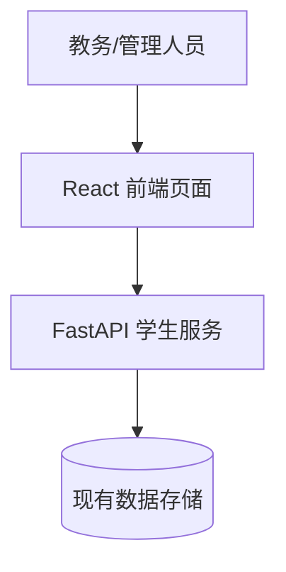
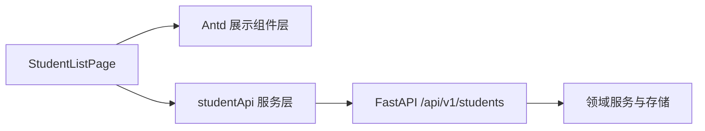
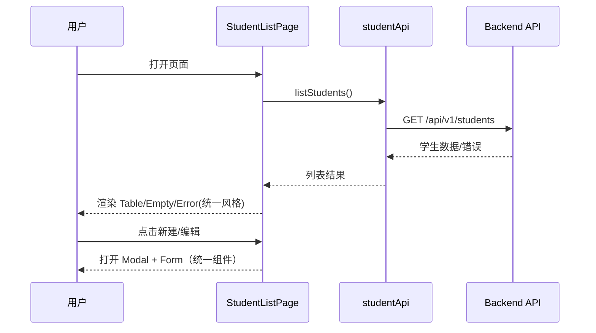

# 方案设计

**功能分支**：`feature/SPEC-202603301607/003-switch-antd-components`
**创建日期**：2026-03-30
**规范**：`/Users/1998hx/Desktop/python-study/specs/003-switch-antd-components/spec.md`
**研究**：`/Users/1998hx/Desktop/python-study/specs/003-switch-antd-components/temp/research.md`

## 1 概览
本方案聚焦“前端统一使用 React antd 组件库”目标，对学生管理相关页面进行 UI 组件标准化改造，确保按钮、表格、输入、弹窗/提示、加载与空状态在主要流程中表现一致。  
方案遵循“只做必要改造，不扩展业务能力”的原则：不改后端业务接口契约，不新增业务字段，不引入超范围的系统性重构。  
通过建立“页面容器 + 展示组件 + API 服务层”的实现边界、统一反馈场景规范和可量化验收指标，确保改造可执行、可验证、可持续演进。

## 2 技术背景

<!--
  需要操作: 将此部分内容替换为项目的技术细节.
  此处的结构以咨询性质呈现, 用于指导迭代过程.
-->

**语言/版本**: TypeScript 5.x（前端），Python 3.11（后端维持现状）
**主要依赖**: React + Vite + Ant Design（前端），FastAPI（后端维持现状）
**存储**: 不适用（本次不新增存储结构，沿用现有后端数据源）
**测试**: 前端组件/页面回归测试 + 关键流程手工验收；后端接口回归冒烟
**目标平台**: 现代桌面浏览器
**项目类型**: Web 应用（前后端分离）
**性能目标**: 页面在正常网络环境下 3 秒内可见主要交互控件；关键操作反馈即时可感知
**约束条件**: 不修改后端业务 API；不引入用户未要求的复杂机制；保持当前业务文案语义
**规模/范围**: 覆盖学生管理相关核心页面与核心交互控件（按钮、表格、输入、反馈、空态）

## 3 项目结构
### 文档(此功能)

```
specs/003-switch-antd-components/
├── spec.md
├── design.md
├── checklists/
│   └── requirements.md
└── temp/
    ├── research.md
    ├── data-model.md
    ├── quickstart.md
    └── contracts/
        └── frontend-ui-contract.yaml
```

### 源代码(仓库根目录)

```
backend/
├── src/
│   └── api/
│       └── student_scores.py
└── tests/

frontend/
├── src/
│   ├── components/
│   │   └── StudentFormModal.tsx
│   ├── pages/
│   │   └── StudentListPage.tsx
│   └── services/
│       └── studentApi.ts
└── tests/
```

## 4 项目架构
### 4.1 系统上下文
本需求属于现有学生管理功能的前端体验升级。用户在浏览器端进行学生查看与编辑操作，前端保持与现有后端 API 交互，仅将 UI 组件与反馈模式统一为 antd 体系。

### 4.2 系统架构
前端采用容器页协调状态，展示组件负责渲染与交互，服务层负责请求封装。  
本次改造仅替换和统一 UI 组件，不改变后端业务处理链路。


## 5 核心实体
### 5.1 服务内部实体
#### 实体1: FrontendUiComponentUsage
**位置**：`frontend/src/pages/StudentListPage.tsx` 与 `frontend/src/components/*`

**职责**：描述页面交互类型与实际组件映射关系，用于实施与验收的一致性核对。

**字段定义**：

| 字段名 | 类型 | 必填 | 是否新增字段 | 说明   |
|--------|------|----|--------|------|
| pageName | string | ✅  | ✅      | 页面标识 |
| interactionType | string | ✅  | ✅      | 交互类型 |
| componentType | string | ✅  | ✅      | 使用的组件类别 |
| fallbackPolicy | string | ✅  | ✅      | 例外策略 |

**关键说明**：
- 该实体为设计与验收抽象，不引入后端持久化字段。
- 覆盖范围必须包含按钮、表格、输入、反馈、空状态等核心控件。

### 5.2 外部依赖接口实体
#### 实体1：Student API 响应实体（既有）
**来源**：`backend/src/api/student_scores.py`

**用途**：为前端页面提供学生列表/编辑等业务数据，本次仅消费不变更。

**字段定义**：

| 字段名 | 类型 | 必填 | 说明   |
|--------|------|----|------|
| id | number | ✅  | 学生ID |
| name | string | ✅  | 学生姓名 |
| student_no | string | ✅  | 学号 |
| gender | string | ✅  | 性别 |


**关键说明**：
- 前端需在服务层做字段映射（如 `student_no -> studentNo`），保持 UI 层字段风格统一。

## 6 关键功能
### 6.1 关键组件与接口
#### 组件1：StudentListPage（容器页）
**位置**：`frontend/src/pages/StudentListPage.tsx`

**职责**：管理列表加载、错误状态、弹窗开关与数据刷新；驱动展示组件按统一控件策略渲染。

**接口**：
- input: `listStudents()` 返回的学生列表数据、用户点击动作
- output: 统一样式的按钮/表格/错误反馈/弹窗交互

**依赖项**：
- `frontend/src/components/StudentFormModal.tsx`
- `frontend/src/services/studentApi.ts`
- Ant Design 组件（Button/Table/Form/Input/Modal/Message/Spin/Empty）

**核心逻辑（核心功能）**：
1. 页面首次加载时进入 loading，成功后渲染列表；失败时给出一致错误提示并可重试。
2. 用户点击“新建/编辑”时，统一使用组件库弹窗承载表单流程。
3. 用户提交/取消操作时，输出一致的成功/失败/取消反馈，不出现原生弹窗主流程交互。

**单元测试**：
- 用例1：加载成功时渲染列表和主要操作按钮。
- 用例2：加载失败时渲染错误提示并支持重试。
- 用例3：打开新建/编辑弹窗时展示统一表单控件。

**边界场景**：
- 边界场景1：返回空列表
  - 解决方式：展示统一空状态并保留可操作入口。
- 边界场景2：接口返回字段异常
  - 解决方式：展示兜底占位内容并记录错误，不中断主流程。

**异常处理**：
- 网络异常/超时：显示统一错误反馈并提供重试。
- 业务失败：展示可理解失败提示，保持页面可继续操作。

### 6.2 组件依赖关系
- `StudentListPage` 依赖 `studentApi` 获取数据，依赖展示组件输出统一 UI。
- 展示组件依赖 antd 基础控件，统一交互表现和状态反馈。
- 后端接口层与领域服务维持现有依赖关系，不在本次改造中变更。

### 6.3 数据流图


## 7 API设计
本次不新增后端业务接口，沿用现有 `/api/v1/students` 相关接口。  
为便于验收，本方案补充前端交互契约文档：`temp/contracts/frontend-ui-contract.yaml`。

### 7.1 API 1：GET /api/v1/students（既有）
**位置**: `backend/src/api/student_scores.py`

**用途**: 获取学生列表，供前端统一表格控件渲染

**是否新增接口**: 否

**接口入参**: 无（当前实现）

**接口出参**: 学生数组（包含 `id/name/student_no` 等）

**关键说明**：前端需做字段映射并保持 UI 控件一致反馈。

## 8 宪章合规性检查
本方案在设计前后均进行宪章核对，结果：通过。  
- 代码质量: 采用容器页 + 展示组件 + 服务层职责拆分，避免单点复杂度持续增长。  
- 测试标准: 覆盖加载成功/失败、空态、校验失败、操作反馈等关键路径，并要求回归验证。  
- 用户体验一致性: 所有核心交互统一到 antd 组件与一致反馈策略，杜绝主流程原生弹窗。  
- 性能要求: 明确“3 秒内可见主要交互控件”的验收目标，并在 quickstart 中定义验证步骤。  
- 范围控制: 不改后端业务契约、不扩展新业务能力，严格遵守 YAGNI 与禁止过度设计。

## 9 方案设计checkList
### 架构
- [x] 高维架构描述清晰
- [x] 组件职责定义清晰
- [x] 组件之间的依赖关系已明确
- [x] 技术选型有合理的论证

### 需求符合度
- [x] 设计满足所有功能性需求
- [x] 已考虑非功能性需求
- [x] 该设计可以满足成功标准
- [x] 已处理或说明约束和假设

### 技术质量
- [x] 设计遵循既定的模式和原则
- [x] 已考虑安全性相关问题
- [x] 已考虑性能要求
- [x] 错误处理机制全面
- [x] 明确说明未引入非必要复杂机制（符合禁止过度设计）

### 实施准备度
- [x] 设计细节足以支撑实现
- [x] 数据实体完整且已验证
- [x] API 规格说明详尽
- [x] 测试策略全面

### 可维护性
- [x] 设计支持未来的可扩展性
- [x] 组件之间保持松耦合
- [x] 配置实现外部化
- [x] 包含监控和可观测性设计
- [x] 用户可见行为与现有体验保持一致

